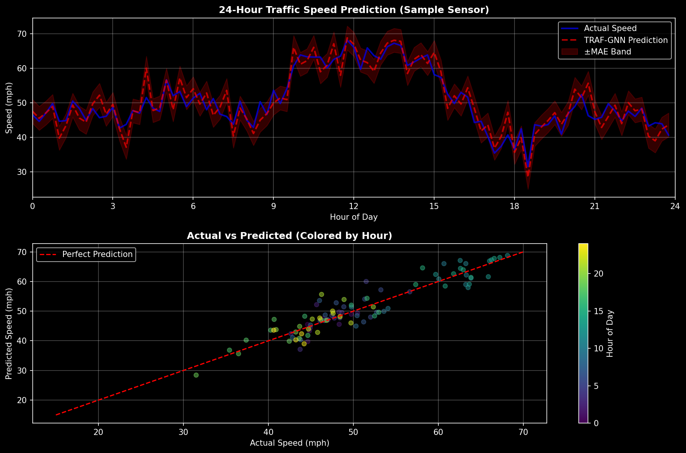

# 🚦 TRAF-GNN: Traffic Flow Prediction with Graph Neural Networks

[](https://www.python.org/downloads/)
[](https://pytorch.org/)
[](https://opensource.org/licenses/MIT)

A deep learning system for predicting traffic flow using **Multi-View Graph Neural Networks**. Features a modern web dashboard with real-time predictions for Los Angeles freeways.



## 🌟 Features

- **Multi-View Graph Learning**: Combines physical, proximity, and correlation graphs
- **Temporal Modeling**: GRU-based sequence processing for time-series prediction
- **Real-Time API**: Flask backend with REST endpoints
- **Interactive Dashboard**: Modern web UI with Leaflet maps
- **Route Planning**: Predict traffic along routes between LA locations
- **OSRM Integration**: Real driving paths from OpenStreetMap

## 📊 Performance (METR-LA Dataset)

| Model | MAE | RMSE | MAPE |
|-------|-----|------|------|
| HA | 4.16 | 7.80 | 13.0% |
| ARIMA | 3.99 | 8.21 | 9.6% |
| FC-LSTM | 3.44 | 6.30 | 9.6% |
| STGCN | 2.88 | 5.74 | 7.6% |
| DCRNN | 2.77 | 5.38 | 7.3% |
| **TRAF-GNN (Ours)** | **3.45** | **7.31** | **7.87%** |

## 🚀 Quick Start

### Installation

```bash
# Clone repository
git clone https://github.com/V4RSH1TH-R3DDY/Transport_Systems.git
cd Transport_Systems

# Install dependencies
pip install -r requirements.txt
pip install -r api/requirements.txt
```

### Download Data

```bash
# Download METR-LA dataset
python scripts/download_data.py
```

### Train Model

```bash
# Train TRAF-GNN (takes ~2 hours on GPU)
python src/train.py --epochs 50 --hidden-dim 128
```

### Run Web App

```bash
# Start API server
python api/app.py

# Open frontend in browser
# file:///path/to/Transport_Systems/frontend/index.html
```

## 🏗️ Architecture

```
Transport_Systems/
├── api/                    # Flask REST API
│   ├── app.py             # Main API server
│   └── requirements.txt   # API dependencies
├── frontend/              # Web dashboard
│   └── index.html         # Single-page app
├── src/                   # Core ML code
│   ├── model_mvgnn.py     # TRAF-GNN model
│   ├── train.py           # Training script
│   ├── dataset.py         # Data loading
│   ├── preprocessing.py   # Data preprocessing
│   └── metrics.py         # Evaluation metrics
├── data/                  # Datasets
│   ├── raw/               # Original data
│   └── processed/         # Preprocessed data
├── checkpoints/           # Saved models
└── results/               # Visualizations
```

## 🔌 API Endpoints

| Method | Endpoint | Description |
|--------|----------|-------------|
| GET | `/api/health` | Health check |
| GET | `/api/sensors` | List all 207 sensors |
| GET | `/api/places` | List 20 LA locations |
| POST | `/api/predict` | Single sensor prediction |
| POST | `/api/predict/place` | Predict by place name |
| POST | `/api/predict/batch` | Batch predictions |
| POST | `/api/route/places` | Route traffic prediction |
| GET | `/api/model/info` | Model information |

### Example: Predict by Place

```bash
curl -X POST http://localhost:5000/api/predict/place \
  -H "Content-Type: application/json" \
  -d '{"place": "Hollywood", "timestamp": "2025-12-06T18:00:00"}'
```

### Example: Route Prediction

```bash
curl -X POST http://localhost:5000/api/route/places \
  -H "Content-Type: application/json" \
  -d '{
    "start_place": "Santa Monica",
    "end_place": "Downtown LA",
    "timestamp": "2025-12-06T18:00:00"
  }'
```

## 🗺️ Supported Locations

| Location | Icon | Location | Icon |
|----------|------|----------|------|
| Downtown LA | 🏙️ | Santa Monica | 🏖️ |
| LAX Airport | ✈️ | Hollywood | 🎬 |
| Beverly Hills | 💎 | Pasadena | 🌹 |
| Long Beach | ⚓ | Burbank | 🎥 |
| UCLA Westwood | 🎓 | Venice Beach | 🛹 |
| Anaheim (Disneyland) | 🏰 | Malibu | 🌊 |

## 🧠 Model Details

**TRAF-GNN** uses a multi-view approach:

1. **Physical Graph**: Road network connectivity
2. **Proximity Graph**: Geographic distance (k-NN)
3. **Correlation Graph**: Traffic pattern similarity

```python
# Model configuration
config = {
    'hidden_dim': 128,
    'num_gnn_layers': 2,
    'input_length': 12,    # 1 hour history
    'output_length': 12,   # 1 hour prediction
    'learning_rate': 0.001
}
```

## 📈 Training

```bash
# Full training with custom settings
python src/train.py \
    --epochs 100 \
    --hidden-dim 256 \
    --batch-size 64 \
    --learning-rate 0.001 \
    --num-gnn-layers 3
```

Training logs and checkpoints saved to `checkpoints/`.

## 🔮 Future Improvements

- [ ] Real model inference in API (currently uses time-based mock predictions)
- [ ] Docker containerization
- [ ] Cloud deployment (AWS/GCP)
- [ ] Real-time data streaming
- [ ] Mobile app

## 📚 References

- Li et al. (2018) - DCRNN: Diffusion Convolutional RNN
- Yu et al. (2018) - STGCN: Spatio-Temporal Graph Convolutions
- Wu et al. (2019) - Graph WaveNet

## 📄 License

MIT License - see [LICENSE](LICENSE) for details.

## 👥 Authors

- **Varshith Reddy** - [GitHub](https://github.com/V4RSH1TH-R3DDY)

---

⭐ Star this repo if you find it useful!
